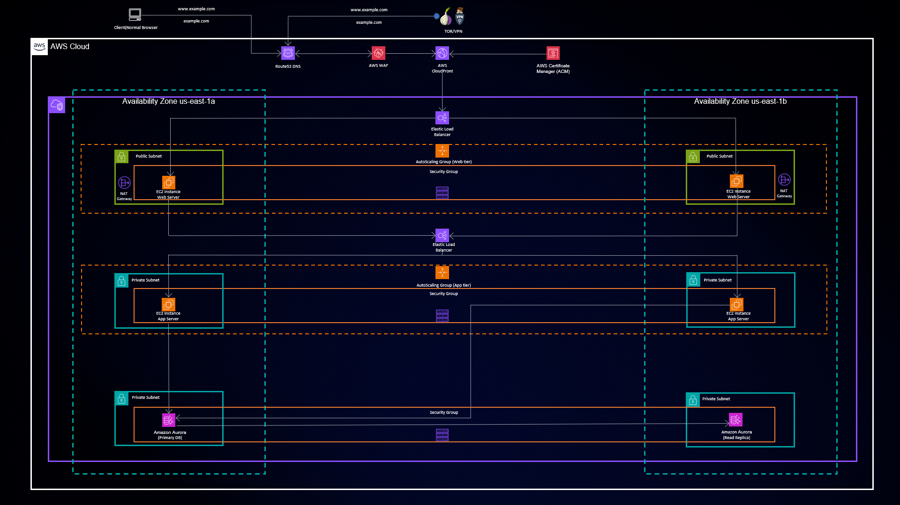

# Three-Tier Architecture Deployment on AWS with Terraform

 </img>

## Introduction

Welcome to the realm of Three-Tier Architecture deployment on Amazon Web Services (AWS) made simple and efficient with Terraform. This repository serves as your gateway to effortlessly setting up a robust and scalable Three-Tier Architecture for your applications. Harness the power of Infrastructure as Code (IaC) and streamline your deployment process like never before.

## Project Overview

This project takes the complexity out of deploying a Three-Tier Architecture on AWS. By automating the creation of your entire infrastructure, it allows you to focus on what matters most – your application's core logic. Whether you're a seasoned developer or new to the AWS ecosystem, this project empowers you to spin up a complete environment with minimal effort.

## Project Highlights

- **VPC: The Foundation**: Create a secure Virtual Private Cloud (VPC) to isolate your application.
- **Load Balancing Magic**: Harness the power of the Application Load Balancer (ALB) for optimal traffic distribution.
- **Auto Scaling Wonders**: Leverage Auto Scaling Group to ensure performance and resilience.
- **Database Sorcery**: Deploy Amazon RDS for managed database services.
- **DNS Mastery**: Use Route 53 for domain registration and DNS management.
- **Static Content Wizardry**: Utilize Amazon S3 to manage static assets/code.

## License

This project is licensed under the [MIT License](LICENSE).
<!-- BEGIN_TF_DOCS -->
## Requirements

| Name | Version |
|------|---------|
|  [terraform](#requirement\_terraform) | >=0.13.0 |
|  [aws](#requirement\_aws) | >= 2.7.0 |

## Providers

| Name | Version |
|------|---------|
|  [aws](#provider\_aws) | >= 2.7.0 |
|  [aws.use\_default\_region](#provider\_aws.use\_default\_region) | >= 2.7.0 |

## Modules

No modules.

## Resources

| Name | Type |
|------|------|
| [aws_acm_certificate.cert](https://registry.terraform.io/providers/hashicorp/aws/latest/docs/resources/acm_certificate) | resource |
| [aws_acm_certificate_validation.cert](https://registry.terraform.io/providers/hashicorp/aws/latest/docs/resources/acm_certificate_validation) | resource |
| [aws_autoscaling_group.App-ASG](https://registry.terraform.io/providers/hashicorp/aws/latest/docs/resources/autoscaling_group) | resource |
| [aws_autoscaling_group.Web-ASG](https://registry.terraform.io/providers/hashicorp/aws/latest/docs/resources/autoscaling_group) | resource |
| [aws_autoscaling_policy.app-custom-cpu-policy](https://registry.terraform.io/providers/hashicorp/aws/latest/docs/resources/autoscaling_policy) | resource |
| [aws_autoscaling_policy.app-custom-cpu-policy-scaledown](https://registry.terraform.io/providers/hashicorp/aws/latest/docs/resources/autoscaling_policy) | resource |
| [aws_autoscaling_policy.web-custom-cpu-policy](https://registry.terraform.io/providers/hashicorp/aws/latest/docs/resources/autoscaling_policy) | resource |
| [aws_autoscaling_policy.web-custom-cpu-policy-scaledown](https://registry.terraform.io/providers/hashicorp/aws/latest/docs/resources/autoscaling_policy) | resource |
| [aws_cloudfront_distribution.cdn-web-elb-distribution](https://registry.terraform.io/providers/hashicorp/aws/latest/docs/resources/cloudfront_distribution) | resource |
| [aws_cloudwatch_metric_alarm.app-custom-cpu-alarm](https://registry.terraform.io/providers/hashicorp/aws/latest/docs/resources/cloudwatch_metric_alarm) | resource |
| [aws_cloudwatch_metric_alarm.app-custom-cpu-alarm-scaledown](https://registry.terraform.io/providers/hashicorp/aws/latest/docs/resources/cloudwatch_metric_alarm) | resource |
| [aws_cloudwatch_metric_alarm.web-custom-cpu-alarm](https://registry.terraform.io/providers/hashicorp/aws/latest/docs/resources/cloudwatch_metric_alarm) | resource |
| [aws_cloudwatch_metric_alarm.web-custom-cpu-alarm-scaledown](https://registry.terraform.io/providers/hashicorp/aws/latest/docs/resources/cloudwatch_metric_alarm) | resource |
| [aws_db_subnet_group.db_subnet_group](https://registry.terraform.io/providers/hashicorp/aws/latest/docs/resources/db_subnet_group) | resource |
| [aws_eip.eip1](https://registry.terraform.io/providers/hashicorp/aws/latest/docs/resources/eip) | resource |
| [aws_eip.eip2](https://registry.terraform.io/providers/hashicorp/aws/latest/docs/resources/eip) | resource |
| [aws_iam_instance_profile.test_profile](https://registry.terraform.io/providers/hashicorp/aws/latest/docs/resources/iam_instance_profile) | resource |
| [aws_iam_role.iam-role](https://registry.terraform.io/providers/hashicorp/aws/latest/docs/resources/iam_role) | resource |
| [aws_iam_role_policy.iam-policy](https://registry.terraform.io/providers/hashicorp/aws/latest/docs/resources/iam_role_policy) | resource |
| [aws_internet_gateway.ig](https://registry.terraform.io/providers/hashicorp/aws/latest/docs/resources/internet_gateway) | resource |
| [aws_launch_configuration.App-LC](https://registry.terraform.io/providers/hashicorp/aws/latest/docs/resources/launch_configuration) | resource |
| [aws_launch_configuration.Web-LC](https://registry.terraform.io/providers/hashicorp/aws/latest/docs/resources/launch_configuration) | resource |
| [aws_lb.app-elb](https://registry.terraform.io/providers/hashicorp/aws/latest/docs/resources/lb) | resource |
| [aws_lb.web-elb](https://registry.terraform.io/providers/hashicorp/aws/latest/docs/resources/lb) | resource |
| [aws_lb_listener.app-elb-listener](https://registry.terraform.io/providers/hashicorp/aws/latest/docs/resources/lb_listener) | resource |
| [aws_lb_listener.web-alb-listener](https://registry.terraform.io/providers/hashicorp/aws/latest/docs/resources/lb_listener) | resource |
| [aws_lb_target_group.app-tg](https://registry.terraform.io/providers/hashicorp/aws/latest/docs/resources/lb_target_group) | resource |
| [aws_lb_target_group.web-tg](https://registry.terraform.io/providers/hashicorp/aws/latest/docs/resources/lb_target_group) | resource |
| [aws_nat_gateway.ng1](https://registry.terraform.io/providers/hashicorp/aws/latest/docs/resources/nat_gateway) | resource |
| [aws_nat_gateway.ng2](https://registry.terraform.io/providers/hashicorp/aws/latest/docs/resources/nat_gateway) | resource |
| [aws_rds_cluster.aurora_cluster](https://registry.terraform.io/providers/hashicorp/aws/latest/docs/resources/rds_cluster) | resource |
| [aws_rds_cluster_instance.primary_instance](https://registry.terraform.io/providers/hashicorp/aws/latest/docs/resources/rds_cluster_instance) | resource |
| [aws_rds_cluster_instance.read_replica_instance](https://registry.terraform.io/providers/hashicorp/aws/latest/docs/resources/rds_cluster_instance) | resource |
| [aws_route53_record.apex](https://registry.terraform.io/providers/hashicorp/aws/latest/docs/resources/route53_record) | resource |
| [aws_route53_record.cert_validation](https://registry.terraform.io/providers/hashicorp/aws/latest/docs/resources/route53_record) | resource |
| [aws_route53_record.www](https://registry.terraform.io/providers/hashicorp/aws/latest/docs/resources/route53_record) | resource |
| [aws_route_table.private-rt1](https://registry.terraform.io/providers/hashicorp/aws/latest/docs/resources/route_table) | resource |
| [aws_route_table.private-rt2](https://registry.terraform.io/providers/hashicorp/aws/latest/docs/resources/route_table) | resource |
| [aws_route_table.private-rt3](https://registry.terraform.io/providers/hashicorp/aws/latest/docs/resources/route_table) | resource |
| [aws_route_table.private-rt4](https://registry.terraform.io/providers/hashicorp/aws/latest/docs/resources/route_table) | resource |
| [aws_route_table.public-rt1](https://registry.terraform.io/providers/hashicorp/aws/latest/docs/resources/route_table) | resource |
| [aws_route_table.public-rt2](https://registry.terraform.io/providers/hashicorp/aws/latest/docs/resources/route_table) | resource |
| [aws_route_table_association.private-rt-association1](https://registry.terraform.io/providers/hashicorp/aws/latest/docs/resources/route_table_association) | resource |
| [aws_route_table_association.private-rt-association2](https://registry.terraform.io/providers/hashicorp/aws/latest/docs/resources/route_table_association) | resource |
| [aws_route_table_association.private-rt-association3](https://registry.terraform.io/providers/hashicorp/aws/latest/docs/resources/route_table_association) | resource |
| [aws_route_table_association.private-rt-association4](https://registry.terraform.io/providers/hashicorp/aws/latest/docs/resources/route_table_association) | resource |
| [aws_route_table_association.public-rt-association1](https://registry.terraform.io/providers/hashicorp/aws/latest/docs/resources/route_table_association) | resource |
| [aws_route_table_association.public-rt-association2](https://registry.terraform.io/providers/hashicorp/aws/latest/docs/resources/route_table_association) | resource |
| [aws_s3_bucket.s3-bucket](https://registry.terraform.io/providers/hashicorp/aws/latest/docs/resources/s3_bucket) | resource |
| [aws_s3_bucket_public_access_block.public-access-block](https://registry.terraform.io/providers/hashicorp/aws/latest/docs/resources/s3_bucket_public_access_block) | resource |
| [aws_s3_object.object](https://registry.terraform.io/providers/hashicorp/aws/latest/docs/resources/s3_object) | resource |
| [aws_security_group.App-SG](https://registry.terraform.io/providers/hashicorp/aws/latest/docs/resources/security_group) | resource |
| [aws_security_group.Database-SG](https://registry.terraform.io/providers/hashicorp/aws/latest/docs/resources/security_group) | resource |
| [aws_security_group.Web-SG](https://registry.terraform.io/providers/hashicorp/aws/latest/docs/resources/security_group) | resource |
| [aws_security_group.app-elb-sg](https://registry.terraform.io/providers/hashicorp/aws/latest/docs/resources/security_group) | resource |
| [aws_security_group.web-elb-sg](https://registry.terraform.io/providers/hashicorp/aws/latest/docs/resources/security_group) | resource |
| [aws_subnet.private-subnet1](https://registry.terraform.io/providers/hashicorp/aws/latest/docs/resources/subnet) | resource |
| [aws_subnet.private-subnet2](https://registry.terraform.io/providers/hashicorp/aws/latest/docs/resources/subnet) | resource |
| [aws_subnet.private-subnet3](https://registry.terraform.io/providers/hashicorp/aws/latest/docs/resources/subnet) | resource |
| [aws_subnet.private-subnet4](https://registry.terraform.io/providers/hashicorp/aws/latest/docs/resources/subnet) | resource |
| [aws_subnet.public-subnet1](https://registry.terraform.io/providers/hashicorp/aws/latest/docs/resources/subnet) | resource |
| [aws_subnet.public-subnet2](https://registry.terraform.io/providers/hashicorp/aws/latest/docs/resources/subnet) | resource |
| [aws_vpc.vpc](https://registry.terraform.io/providers/hashicorp/aws/latest/docs/resources/vpc) | resource |
| [aws_wafv2_web_acl.web_acl](https://registry.terraform.io/providers/hashicorp/aws/latest/docs/resources/wafv2_web_acl) | resource |
| [aws_route53_zone.zone](https://registry.terraform.io/providers/hashicorp/aws/latest/docs/data-sources/route53_zone) | data source |

## Inputs

| Name | Description | Type | Default | Required |
|------|-------------|------|---------|:--------:|
|  [ami\_id](#input\_ami\_id) | This will help you to create the AMI on AWS, Here we have created Ubuntu AMI To run this use command, 'terraform packer build AMI-Creation.pkr.hcl' | `string` | `"ami-053b0d53c279acc90"` | no |
|  [bucket-name](#input\_bucket-name) | n/a | `string` | `"three-tier-cls18112023"` | no |
|  [cdn-name](#input\_cdn-name) | n/a | `string` | `"CDN-Web-ALB-Distribution"` | no |
|  [db-name](#input\_db-name) | n/a | `string` | `"OnlineShopping"` | no |
|  [domain-name](#input\_domain-name) | n/a | `string` | `"carvalho.tech"` | no |
|  [eip1-name](#input\_eip1-name) | n/a | `string` | `"Nat-IP1"` | no |
|  [eip2-name](#input\_eip2-name) | n/a | `string` | `"NAT-IP2"` | no |
|  [ig-name](#input\_ig-name) | n/a | `string` | `"Three-tier-IG"` | no |
|  [ng1-name](#input\_ng1-name) | n/a | `string` | `"NAT-GW1"` | no |
|  [ng2-name](#input\_ng2-name) | n/a | `string` | `"NAT-GW2"` | no |
|  [private-rt1](#input\_private-rt1) | n/a | `string` | `"Private-RT1"` | no |
|  [private-rt2](#input\_private-rt2) | n/a | `string` | `"Private-RT2"` | no |
|  [private-rt3](#input\_private-rt3) | n/a | `string` | `"Private-RT3"` | no |
|  [private-rt4](#input\_private-rt4) | n/a | `string` | `"Private-RT4"` | no |
|  [private-subnet1](#input\_private-subnet1) | n/a | `string` | `"App-Server1"` | no |
|  [private-subnet2](#input\_private-subnet2) | n/a | `string` | `"App-Server2"` | no |
|  [private-subnet3](#input\_private-subnet3) | n/a | `string` | `"Database-Server1"` | no |
|  [private-subnet4](#input\_private-subnet4) | n/a | `string` | `"Database-Server2"` | no |
|  [public-rt1](#input\_public-rt1) | n/a | `string` | `"Public-RT1"` | no |
|  [public-rt2](#input\_public-rt2) | n/a | `string` | `"Public-RT2"` | no |
|  [public-subnet1](#input\_public-subnet1) | n/a | `string` | `"Web-Server1"` | no |
|  [public-subnet2](#input\_public-subnet2) | n/a | `string` | `"Web-Server2"` | no |
|  [rds-name](#input\_rds-name) | n/a | `string` | `"Three-Tier-RDS"` | no |
|  [rds-pwd](#input\_rds-pwd) | n/a | `string` | `"Aman1234"` | no |
|  [rds-username](#input\_rds-username) | n/a | `string` | `"admin"` | no |
|  [vpc-name](#input\_vpc-name) | n/a | `string` | `"Three-tier-VPC"` | no |
|  [web\_acl\_name](#input\_web\_acl\_name) | n/a | `string` | `"MyWebACL"` | no |

## Outputs

No outputs.
<!-- END_TF_DOCS -->